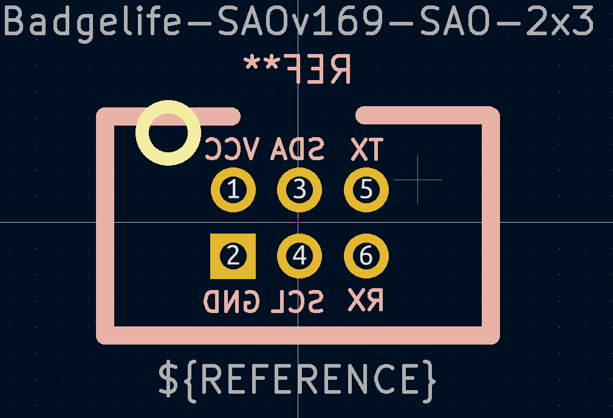
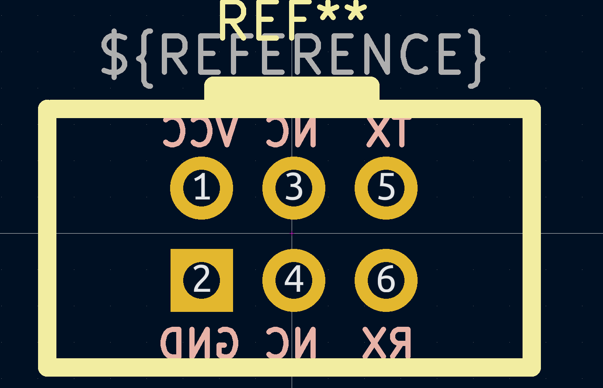

# CHV_SAO_Specification
## Overview
The CHV DC31 SAO specification is intended to allow the easy and cheap creation of SAOs. The main badge will have 3 SAO board adapters. 
Each adapter will supply 3v3, GND, CAN TX, and CAN RX. Unlike the normal SAO standard, the main board will not be exposing I2C to the SAOs from the main board. Instead those two pins will be left NC and floating. The CAN TX and RX pins will be exposed on what is normally GPIO1 and GPIO2 according to the SAO standard. These will connect to a CAN Transcever (most likely a MCP2558FD). Currently CAN 2.0B is expected to be the main protocol in use on the board.

## Desing guidelines 
All other [SAO bis v1.69 design guide](https://hackaday.com/2019/03/20/introducing-the-shitty-add-on-v1-69bis-standard/) should be followed. SAOs should try to remain within 50x50mm in size. If size need to be exceeded for reasons, please consult the CHV to ensure there will be no problems. Similarly try to keep current draw low so as to extend battery life of the badge. The goal is for the badge to last the entire conference.

## Pin descriptions

| Pin | Name | Description|
|-----|------|------------|
| 1 | VCC | 3v3 supply |
| 2 | GND | Ground |
| 3 | NC | Not Connected |
| 4 | NC | Not Connected |
| 5 | TX | CAN BUS TX |
| 6 | RX | CAN BUS RX |

## Footprint
### SAO side connector
This is the side you as a SAO creater will be using

### Badge side connector
This is what is provided by the main badge

